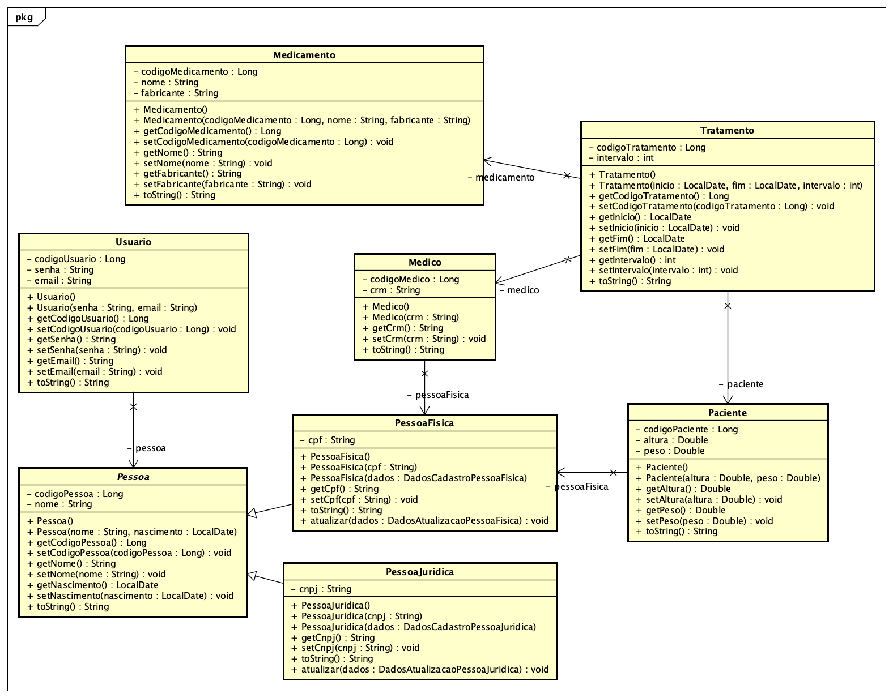
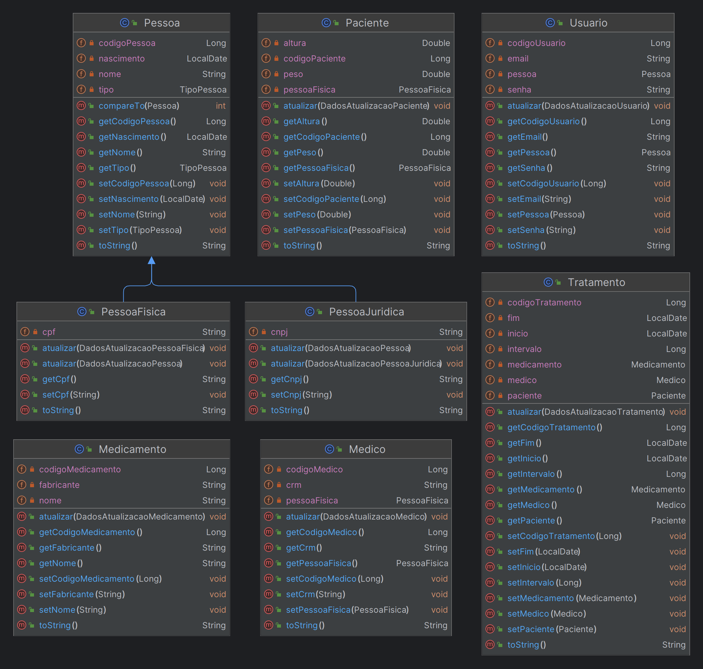
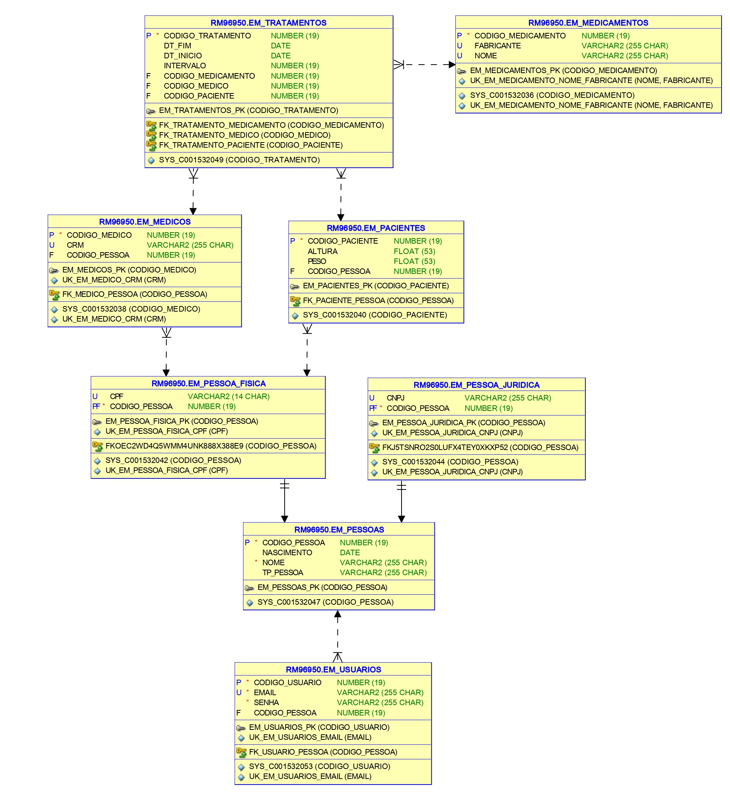
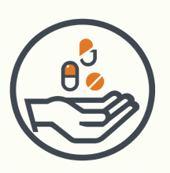

# Global Solution
Turma 2TDSPT - 2023

## Integrantes
- Bruno Barbosa Braga dos Santos - RM96685
- Igor Augusto Takeshigue Lemos - RM97012
- Joederson Oliveira Pereira - RM97192
- Mário Ito Bocchini - RM96950

## Apresentação
- Problema que a solução se propõe a solucionar;
- Maneira como se propõe a solucionar;

O EasyMed é um aplicativo Android que tem como objetivo facilitar o tratamento medicamentoso de pessoas com dificuldade 
visuais ou cognitivas.

Pessoas que tomam muitas medicações, principalmente idosos, podem ter dificuldade em lembrar de tomar seus remédios e 
podem também ter dificuldade de identificar cada um deles.

Com o EasyMed, o usuário pode cadastrar seus medicamentos e horários de uso, e o aplicativo irá notificá-lo quando for 
a hora certa de tomar cada um deles. Além disso, o aplicativo também identifica a caixa do medicamento usando a câmera 
do celular e informa ao usuário o nome do remédio e o horário que deve ser tomado.

 ## Escopo do projeto de desenvolvimento
- **Objetivo:** 
  - Desenvolver um aplicativo Android que auxilie pessoas com dificuldade visual ou cognitiva a tomarem seus remédios.
- **Funcionalidades Principais:** 
    - Cadastro de medicamentos
    - Cadastro de horários de uso
    - Notificação de horários de uso
    - Reconhecimento de texto em caixas de remédio
    - Informação de nome, horário do medicamento
- **Entregáveis:**
  - Aplicativo Android não funcional
  - Aplicação Spring
  - Banco de dados Oracle
  - Código-fonte do Java com Spring
  - Vídeo Pitch
- **Recursos:**
  - 4 desenvolvedores com perfil full-stack
- **Entrega do MVP:**
  - 01/12/2023

## O que está fora do Escopo do MVP;
- Aplicativo Android funcional integrado com o back end
- Aplicativo Ios
- Aplicativo Web (Site)
- Back-end hospedado em servidor

## Tecnologias Utilizadas
- Java 17.0.8 - 2023-07-18 LTS
- Kotlin
- Android Studio
- Spring 3.0.12
- Oracle Database 19c Enterprise Edition Release 19.0.0.0.0 - Production
- Python

## Script Docker e Docker Compose
- Não foi utilizado Docker

## Diagramas
- Diagrama de Classes Astah

<br><br>
- Diagrama de Classes Intellij


- Diagrama de modelagem de Banco de dados


## Links 
- Imagem com link para Video Pitch

<br><br>
- Imagem com link para video com teste das funcionalidades
<br>
[](https://youtu.be/UXqQngKSsbg)

- Link para script do Postman 

```markdown
[Postman JSON](documentacao/EasyMed.postman_collection.json)
```


## Como executar o projeto
1. Clonar o repositório
2. Abrir o projeto em uma IDE Java (Eclipse, IntelliJ, etc)
3. Executar o arquivo `EasyMedApplication.java` como uma aplicação Java
4. Abrir o Postman, Insomnia ou outra aplicação de teste de API
5. Importar o arquivo `EasyMed.postman_collection.json` 
6. Executar as requisições

**OBS:** As instruções acima se aplicam ao ambiente local, a execução em servidor cloud não está no escopo do projeto e nem da disciplina
